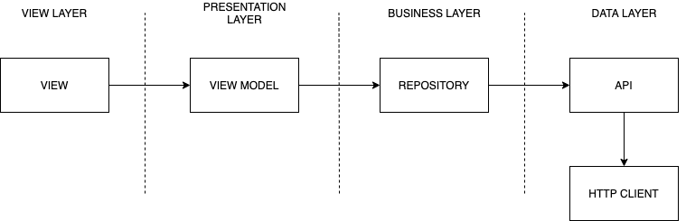

# Prueba Mercado Libre

### REQUERIMIENTOS

De acuerdo a las instrucciones dadas, podrán encontrar en el desarrollo de la app las 3 pantallas solicitadas con su funcionalidad. Traté de ser lo mas fiel posible al diseño original con el fin de lograr una armonía entre en diseño original y el de la prueba.

### PATRÓN DE ARQUITECTURA

Para el proyecto opté por trabajar con **MVVM** ya que para el tipo de trabajo es más sencillo el hacer cambios en una capa sin que afecten excesivamente al resto, ya que para este caso eran pocos los elementos que se integraban al requerimiento.

### TEST

En la siguiente imagen se puede observar en el coverage una cobertura de los test en un **75,6%**, la idea era testear los componentes principales de la app y mostrar la aplicación de este concepto.

Adicionalmente se puede apreciar los tests independietes con el fin de lograr la cobertura anteriormente mencionada en cada una de las capas principales.

### DEPENDENCIAS

Para los llamados http utilicé

**Alamofire**
**AlamofireImage**

